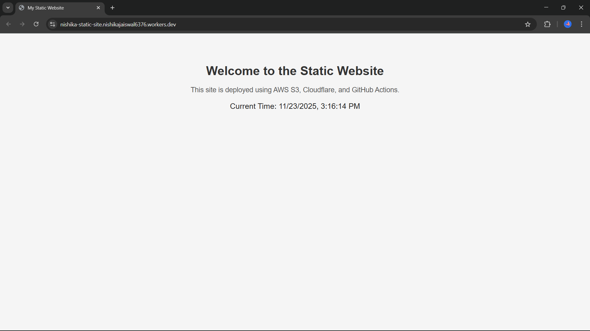
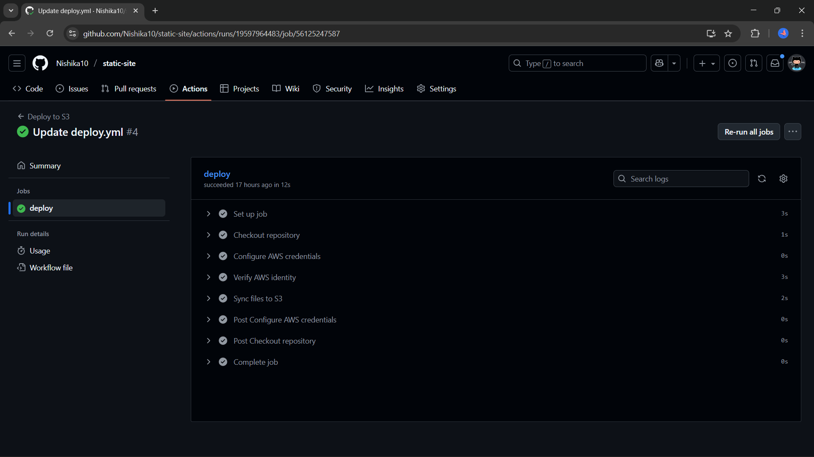

# Scalable Static Website with S3 + Cloudflare + GitHub Actions

## Introduction
This project demonstrates the deployment of a static website (HTML, CSS, JS) hosted on **AWS S3 (Free Tier)** with **global CDN and HTTPS** via **Cloudflare**, and automated deployment using **GitHub Actions**. It features a fully automated CI/CD pipeline, ensuring that updates to the GitHub repository automatically reflect on the live site, providing fast, reliable, and secure website delivery.


## Key Features:
- Static website hosted on AWS S3
- Global Content Delivery via Cloudflare
- HTTPS enabled for secure communication
- Automated deployments via GitHub Actions
- Cache-Control headers for optimized performance
- Versioning enabled for safe rollback

## Tools & Technologies Used
- **AWS S3 (Free Tier)** – Storage and static website hosting  
- **Cloudflare (Free)** – CDN and HTTPS  
- **GitHub Actions** – CI/CD automation  
- **HTML / CSS / JavaScript** – Frontend development  
- **Bash** – Deployment scripts  

## Deployment

The static website is deployed using **AWS S3** for hosting and **Cloudflare** for global CDN and HTTPS. The deployment process is automated through **GitHub Actions**, enabling continuous integration and continuous delivery (CI/CD).

### Steps Followed

1. **AWS S3 Setup**
  - Created an S3 bucket and enabled it for static website hosting.
  - Uploaded `index.html`, `style.css`, and `script.js` files.
  - Configured bucket permissions to allow public read access.

2. **Cloudflare Integration**
  - Connected the S3 website URL to Cloudflare using a free subdomain via Cloudflare Pages.
  - Enabled HTTPS and global CDN for faster and secure content delivery.

3. **GitHub Actions CI/CD**
  - Configured a GitHub Actions workflow to automatically sync repository changes to the S3 bucket.
 - Whenever code is pushed to the main branch, the workflow triggers deployment to AWS S3.

4. **Cache Control & Versioning**
  - Added `Cache-Control` headers to optimize website loading performance.
  - Enabled versioning in the S3 bucket to allow safe rollback if needed.

5. **Cloudflare Worker Code**

```javascript
export default {
  async fetch(request) {
    const url = new URL(request.url);
    const s3URL = "http://nishika-static-site.s3-website-us-east-1.amazonaws.com";
    const newURL = s3URL + url.pathname;
    return fetch(newURL);
  }
};
```

### Live Deployment
- The website is accessible via the Cloudflare URL, reflecting real-time updates whenever changes are pushed to the repository.

## Usage / Examples

This project demonstrates a fully automated static website deployment. Users can interact with the website and see updates automatically reflected after pushing changes to GitHub.

### Usage Steps

1. **Clone the Repository**
   ```bash
   git clone https://github.com/<your-username>/<your-repo>.git
   cd <your-repo>

2. **Make Changes to the Website**

- Edit the index.html, style.css, or script.js files as needed.

- Add new assets like images or additional pages.

3. **Push Changes to GitHub**
```bash
git add .
git commit -m "Update website content"
git push origin main
```

4. **Automatic Deployment**

- GitHub Actions workflow triggers automatically.

- Changes are deployed to the S3 bucket and reflected through Cloudflare CDN.

- Visit the live Cloudflare URL to view the updated website.

### Example

- Update the homepage index.html with new content.

- Push the changes to GitHub.

- The website reflects updates in seconds via Cloudflare, without manual intervention.

## Live Website Link
> https://nishika-static-site.nishikajaiswal6376.workers.dev/  


## Screenshots

### Website Live on Cloudflare


### GitHub Actions Workflow



## Lessons Learned

1. **Static Website Deployment:** Learned to host a static website on AWS S3 and integrate it with Cloudflare for HTTPS and global CDN.  
2. **CI/CD Automation:** Gained hands-on experience with GitHub Actions to automate deployments, ensuring real-time updates on code changes.  
3. **Performance & Reliability:** Understood cache control, versioning, and practical troubleshooting in cloud-based deployments for optimized and secure delivery.


## License

This project is licensed under the MIT License - see the [LICENSE](LICENSE) file for details.

## Author
**Nishika Jaiswal**

Aspiring Cloud & DevOps Engineer